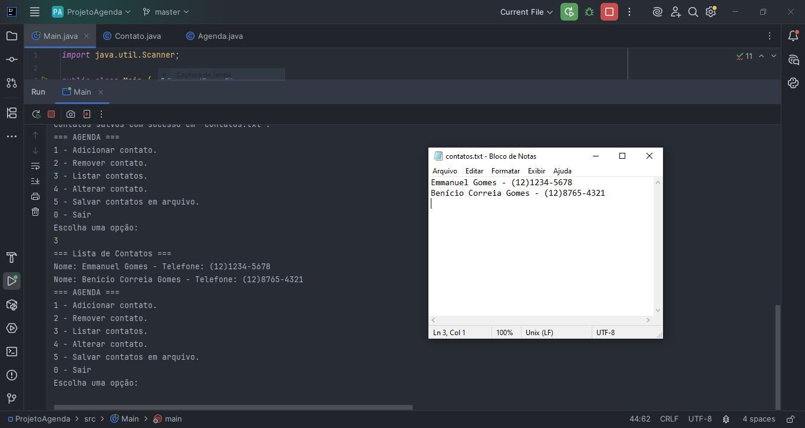
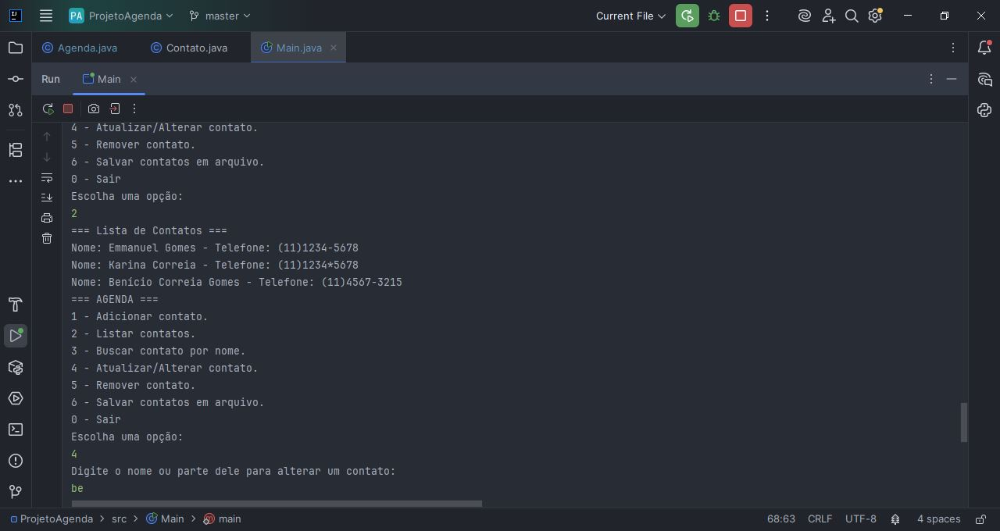
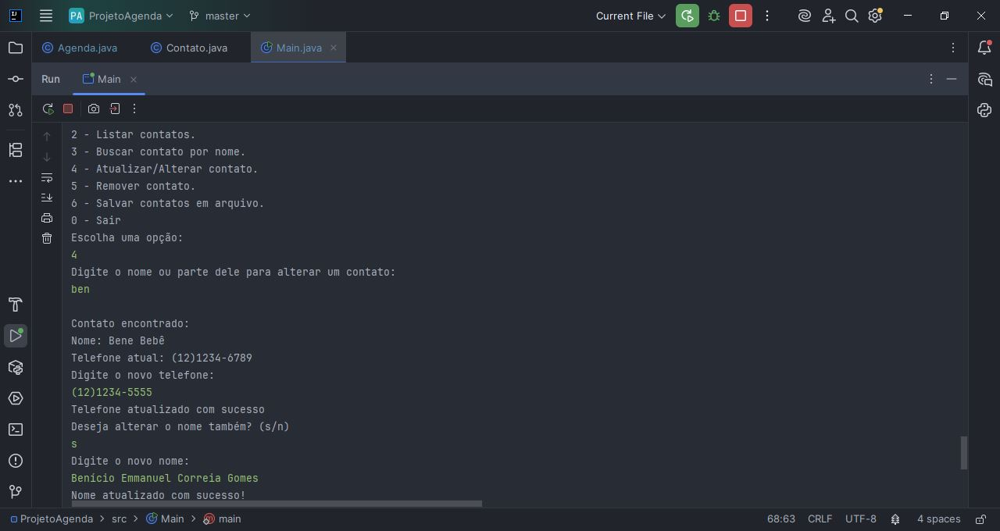

# Projeto Agenda Java

Projeto simples de agenda telefônica usando Java, com funcionalidades básicas de CRUD:

- Adicionar contatos com nome e telefone
- Remover contatos pelo nome
- Listar todos os contatos cadastrados
- Alterar telefone e nome de contatos existentes
- Salvar e carregar contatos em arquivo texto para persistência

## Status do Projeto

✅ CRUD completo implementado:

- Adicionar contatos
- Listar contatos
- Alterar contatos (nome e telefone)
- Remover contatos
- Persistência em arquivo texto

Este projeto está funcional e pronto para uso básico de agenda telefônica.

## Tecnologias usadas

  
  

## Como usar

1. Clone o repositório
2. Compile os arquivos `.java`
3. Execute a classe `Main`
4. Use o menu interativo para gerenciar os contatos

---

## 📷 Demonstração

### ▶️ Agenda rodando no terminal (menu interativo)

### ✅ Contatos cadastrados e salvos

### 🔁 Alteração de contato e salvamento

---

Projeto ideal para iniciantes praticarem orientação a objetos e manipulação básica de dados.

---

**Desenvolvido por Emmanuel Gomes**
